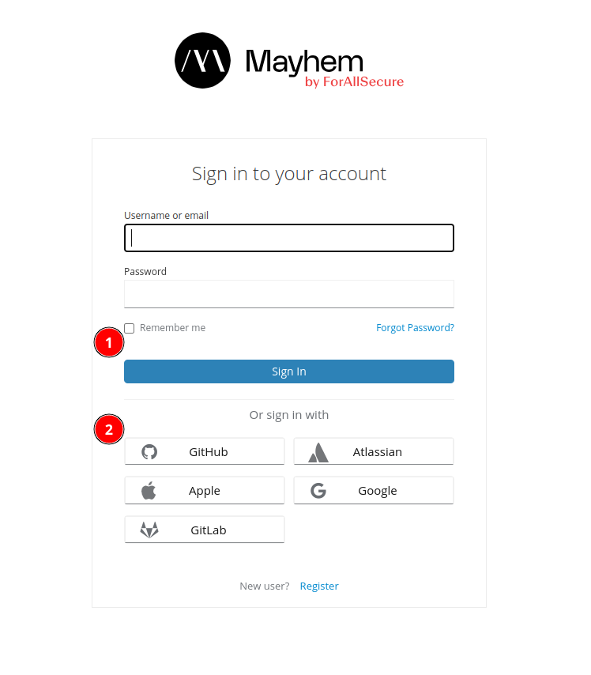
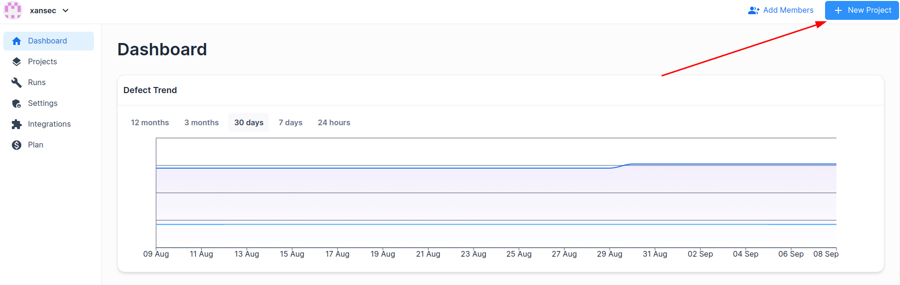
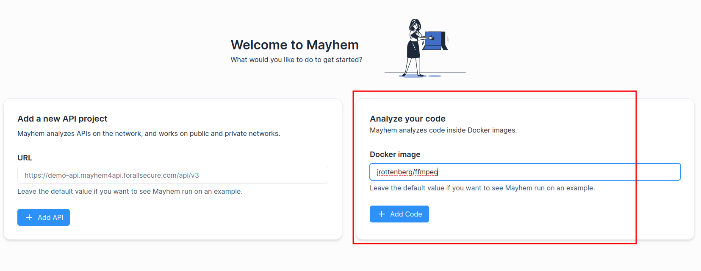
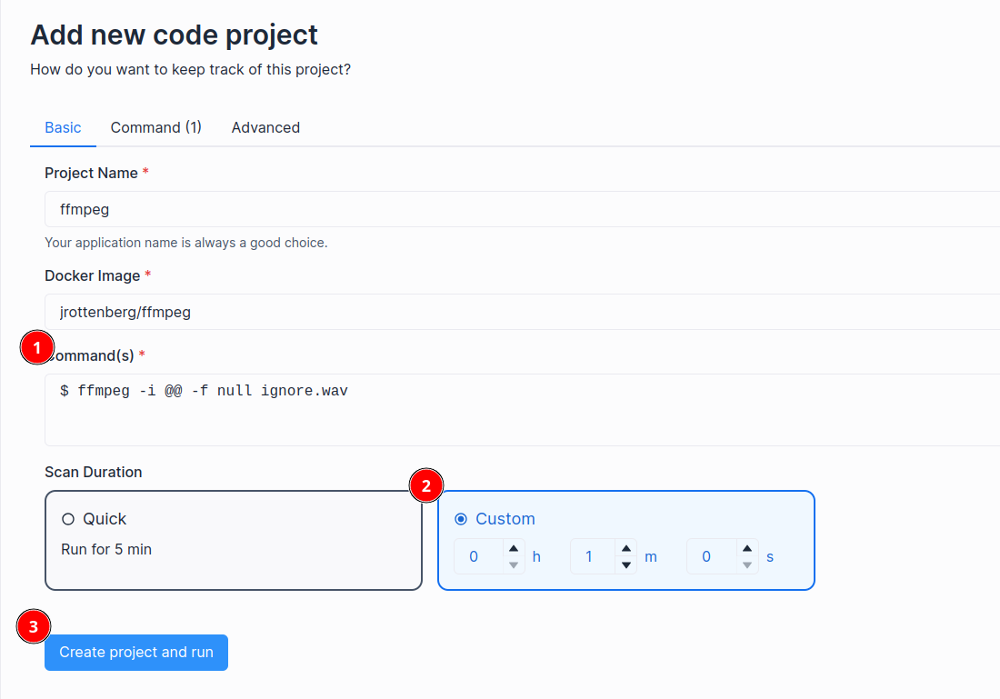
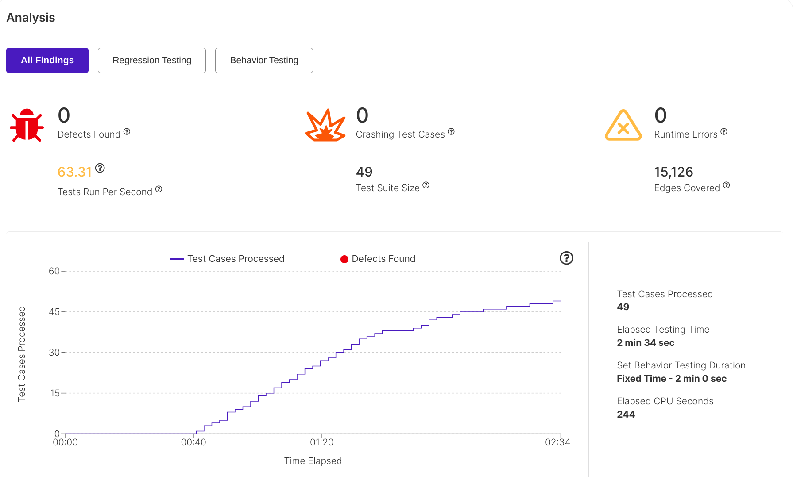
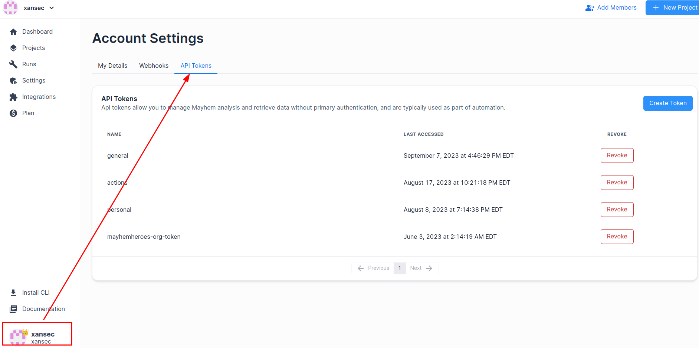

# Lab 1a: Fuzzing a binary in Docker

## Overview

This guide will show you how to package our target binary, `ffmpeg`, and fuzz it with Mayhem.

**Time to complete**: About 5 minutes

## Before we begin!

If you haven't already, create a new account by navigating to
[training.forallsecure.com](https://training.forallsecure.com) and either choose:
   * Google account: Use your Google account on Mayhem
   * "Sign up": Create a local account on the Mayhem instance.



## Step 1. Create a new Run

Let's fuzz `ffmpeg` using an existing Docker image.

   * Create a new project by clicking the "plus" icon at the top of the screen.

   * For image, we'll use an existing image: `jrottenberg/ffmpeg`
   image.


## Step 2. Configure Run

In order to get this fuzzing, we need to make sure we're using the correct options for `ffmpeg`.
At it's core, this binary takes:
1. An input file, and
2. an output file
as well as some options telling `ffmpeg` what to do to the file. We really only need to modify the command
section of this run, then.

   1. Under **Basic**, set the analysis to run 60 seconds. If omitted, analysis will run
      forever in continuous fuzz mode.
   2. Under **Basic**, set the command to `ffmpeg -i @@ -f null ignore.wav`. This tells Mayhem
      to generate a fuzzed file and use it as an input for `ffmpeg`. We will ignore the output,
      as we are only interested in fuzzing the target.

   


## Step 3. Click start run!

Click the start run button at the bottom of your screen to begin analysis!

The run may take a few minutes to complete, as analysis and post-analysis
processing need to finish. Once the run completes, the web page should look
similar to this:




# Lab 1b: Build your own ffmpeg

## Overview

This guide will show you how to build your own container, push it to Mayhem, and start fuzzing.

**Time to complete**: About 5 minutes

## Step 1. Log in to Mayhem with the CLI

The `mayhem` CLI authenticates to the Mayhem server using an API token. The API
token  is available three places:

   * The [download screen](https://training.forallsecure.com/-/installation)
   * In your profile settings, located in the top-left under your username, then
     "Settings", then "API Tokens".
   * Under the "?" help window.

Once you get your API token, log in the CLI:

```
mayhem login https://training.forallsecure.com/ <YOUR API KEY>
```



## Step 2. Create a Dockerfile.

Under the , you will find a Mayhemfile,
a binary (`ffmpeg`), and a Dockerfile with a .TODO suffix.

You will need to add the relevant commands to get this Dockerfile running a working copy of `ffmpeg`

## Step 3. Build and push your image.

Once your Dockerfile is complete, you'll want to build it:

```
docker build -t training.forallsecure.com:5000/<yourname>/ffmpeg

```

You'll then want to push the complete image to Mayhem:

```
docker push training.forallsecure.com:5000/<yourname>/ffmpeg
```


## Step 4. Start the run with the Mayhem CLI.

For this tutorial, no changes to the Mayhemfile are neccesary.You can
start your run with:

```
mayhem run .
```

You should see output that looks similar to this:
```
WARNING: corpus is not a file or directory, skipping
Run started: ffmpeg/ffmpeg/2
Run URL: https://training.forallsecure.com:443/abrewer/ffmpeg/ffmpeg/2
ffmpeg/ffmpeg/2
```

Note the warning regarding the corpus directory is normal for this tutorial.

Navigate to the Web interface for this run by clicking on the "Run URL" from
the output.

The run may take a few minutes to complete, as analysis and
post-analysis processing need to finish. Once the run completes, the web page
should look similar to this:


Congratulations!

You've just:
  * Learned how to build and push a Docker images
  * Learned how to start a Mayhem run from the CLI
