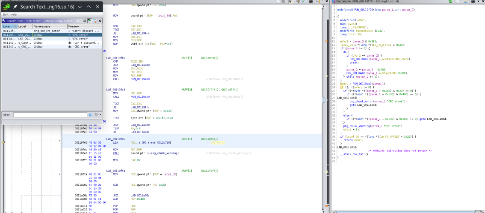
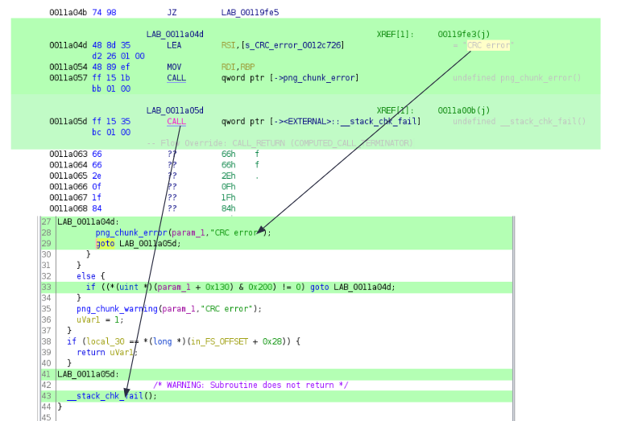
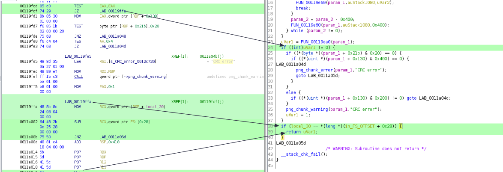
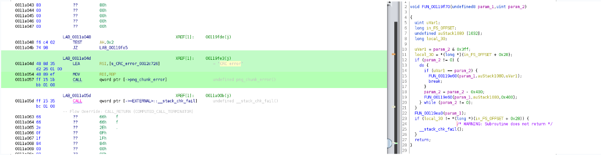
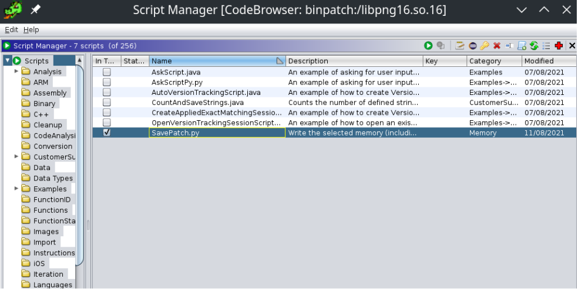

# Lab 1a: Patching a binary with Ghidra

## Overview

This guide will show you how to patch our target binary, `convert`, and fuzz it with Mayhem.

**Time to complete**: About 30 minutes


## Step 0. What's the problem?

When we run imagemagick's `convert` command against a valid png, it works!

```
$ ./convert corpus/nsa-insignia-sm.png /tmp/out.png
Success!
```

With an invalid png, we get this error:

```
$ ./convert corpus/nsa-insignia-crc-error.png /tmp/out.png
convert: IDAT: CRC error `corpus/nsa-insignia-crc-error.png' @ error/png.c/MagickPNGErrorHandler/1713.
convert: no images defined `/tmp/out.png' @ error/convert.c/ConvertImageCommand/3322.
Fail!
```

We need to patch the binary to make this work!

## Step 1. Find the error

The error is coming from a library that imagemagick depends on. How can we find it?
One was is to search for the string "CRC error" within each library. `ldd` comes in handy here.

```
$ for file in $(ldd ./convert | sed -e 's/.*> \(.*\) (.*/\1/g'); do grep "CRC error" $file; done

grep: linux-vdso.so.1: No such file or directory
grep: (0x00007fff8434c000): No such file or directory
grep: /usr/lib/libpng16.so.16: binary file matches
```

Aha! Now we need to load this library into Ghidra and patch it.

# Step 2. Find the error (in the disassembly)

Load the library into Ghidra. You can use Ghidra’s search function to search for strings in the text of the program. After searching, you’ll notice that “CRC error” appears in several locations in the code.




We’ll ignore the “Can’t discard…” strings since that wasn’t in the error we got. The other 3 instances all seem to refer to the same function, so this looks right.

# Step 3. Find the failing subroutine

Now that we've found the error, we need to find what subroutine or label contains it. In this disassembly, it looks like it's `LAB_0011a05d`.



However, there is another another subroutine that doesn't fail: `LAB_00119ffa`



Can we use this somehow?

# Step 4. Patch the instruction

See if you can figure out what to change in the assembly to make the code _always_ hit `LAB_00119ffa`, and never go to `LAB_0011a05d` (essentially, make it dead code).

Hint: `JZ` stands for "Jump if Zero". What if it's not zero? Can we still *jump*?

# Step 5. Save your patch

Once you've patched your instruction, there should no longer be a failing subroutine:



You'll need to save this patch. Unfortunately, Ghidra’s not great with patching ELFs (it’s only meant to patch raw binaries). This [SavePatch.py](imagemagick/ghidra_SavePatch/SavePatch.py) script helps us with writing ELFs as well. First, select (highlight) the instruction address that you patched in Ghidra. Then run the SavePatch.py() script (select the green circle with the white arrow).



Save your patched binary as `patched-libraries/libpng16.so.16`.

# Step 6. Run your patched code

You need to tell `convert` where to find your patched library. You can do this with `LD_LIBRARY_PATH`:

```
LD_LIBRARY_PATH=./libs_patched ./convert testsuite/nsa-insignia-crc-error.png output.png
convert: PNG unsigned integer out of range `testsuite/nsa-insignia-crc-error.png' @ error/png.c/MagickPNGErrorHandler/1492.
```

Hmm, another error. Can you resolve all of the errors by patching? Possibly. For now, pat yourself on the back for completing the binary patching lab!
